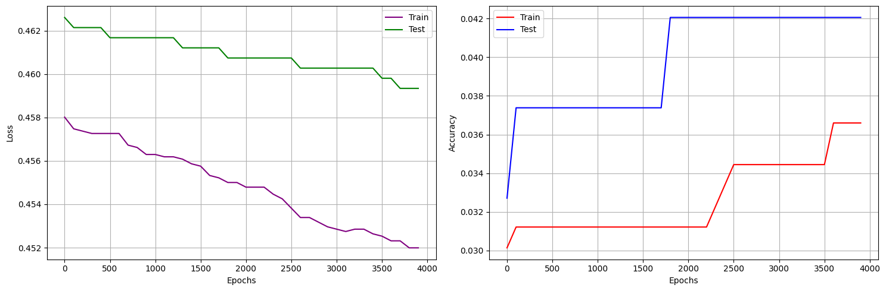
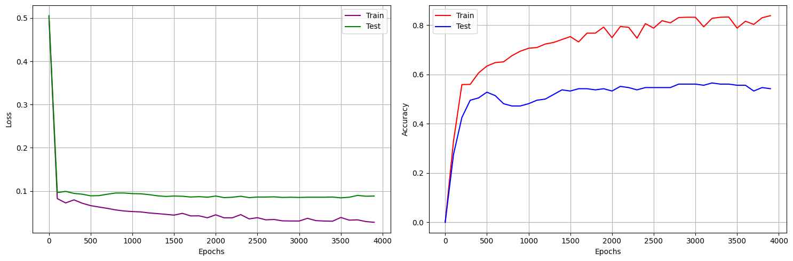
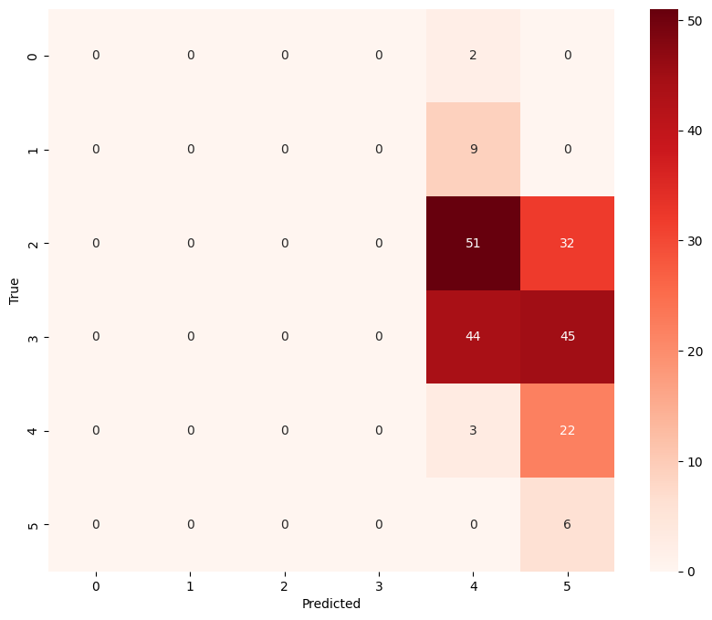
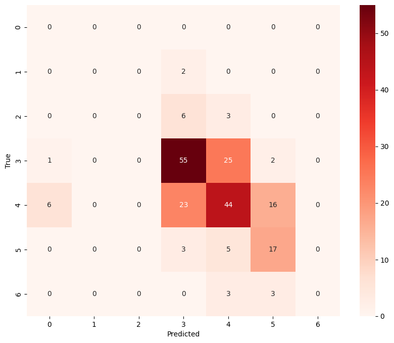

# Wine Quality Classification with a Custom Multilayer Perceptron (MLP) in NumPy

This project implements a **Multilayer Perceptron (MLP) from scratch using only NumPy** to classify red wine samples based on their physicochemical properties. The model is trained on the **Wine Quality Dataset** and evaluated using multiple learning rates and activation functions.

---

## 📂 Dataset

We used the **Red Wine Quality Dataset** from the UCI repository.  
It contains **11 physicochemical attributes** and a target quality score (0–10):

- Fixed acidity  
- Volatile acidity  
- Citric acid  
- Residual sugar  
- Chlorides  
- Free sulfur dioxide  
- Total sulfur dioxide  
- Density  
- pH  
- Sulphates  
- Alcohol  
- Quality (score between 0 and 10)

---

## ⚙️ Data Preprocessing

1. **Data slicing** → Removed the first row (header).  
2. **Train/Test split** → 80% training, 20% testing.  
3. **Normalization** → Standardized each feature using `(x - mean) / std`.  
4. **One-hot encoding** → Converted target labels into one-hot vectors.  

---

## 🧠 Model Implementation

- Implemented an **MLP from scratch** with:
  - Fully connected layers
  - Forward propagation
  - Backpropagation
  - Multiple activation functions
- Trained using **Mean Squared Error (MSE)** as the loss function.  
- Evaluated across **15 different learning rates** in the range `[1e-8, 10]`.

---

## 📊 Results

### 🔹 Loss & Accuracy Curves
For each learning rate, we tracked **training and testing loss** and **accuracy** across epochs.

```
learning_rate = 0.00000001
learning_rate *= 4
```
As an example in the 6th Stage:

<div align="center">

### 🔹 Training vs Testing Loss and Accuracy



</div>


& 15th Stage:

<div align="center">

### 🔹 Training vs Testing Loss and Accuracy



</div>


---

### 🔹 Confusion Matrix
We visualized prediction results on the test set using a confusion matrix.

As an example in the 6th Stage:

<div align="center">

### 🔹 Confusion Matrix


</div>


& 15th Stage:

<div align="center">

### 🔹 Confusion Matrix


</div>

---

### 🔹 Learning Rate Analysis
We tested **15 different learning rates** (from `1e-8` to `10`).  
Results showed:
- Very small learning rates → slow convergence.  
- Very large learning rates → unstable training.  
- Mid-range learning rates (e.g., `0.1 – 1`) gave the best trade-off.

---

## 🔀 Activation Functions

We implemented and tested **10 activation functions**:

1. Sigmoid  
2. Tanh  
3. ReLU  
4. Leaky ReLU  
5. ELU  
6. Rational  
7. Softmax  
8. Swish  
9. Softplus  
10. (Default MLP Sigmoid baseline)

For each activation function, we plotted:

- **Loss vs Accuracy curves**  
- **Confusion matrix**  

👉 As an example results for ReLU are here:

<div align="center">

### 🔹 Training vs Testing Loss and Accuracy


</div>

<div align="center">

### 🔹 Confusion Matrix


</div>
  
---

## 📑 Evaluation Metrics

We report standard classification metrics:

- **Accuracy**  
- **Precision**  
- **Recall**  
- **F1-score**  

👉 Insert example screenshot (ReLU):  

<div align="center">

### 🔹 Evaluation Metrics


</div>

---

## 🔍 Key Observations

- **Normalization** significantly improved convergence.  
- **Tanh, ReLU, and Swish** gave the best performance among tested activations.  
- **Softmax output** worked best for probability distribution across 10 classes.  
- **Leaky ReLU** avoided the dead neuron problem.  
- Very high learning rates (`>5`) caused divergence.  

---

## 🚀 Future Work

- Implement **cross-entropy loss** instead of MSE for classification.  
- Experiment with **deeper/wider networks**.  
- Introduce **regularization techniques** (Dropout, L2 penalty).  
- Optimize training with **momentum/Adam optimizer** (still within NumPy).  

---

## 📜 Citation

Wine Quality Data Set:  
P. Cortez, A. Cerdeira, F. Almeida, T. Matos and J. Reis. *Modeling wine preferences by data mining from physicochemical properties*. Decision Support Systems, Elsevier, 47(4):547-553, 2009.

---

## 🧑‍💻 Author

Developed by **Madadi. S**  
